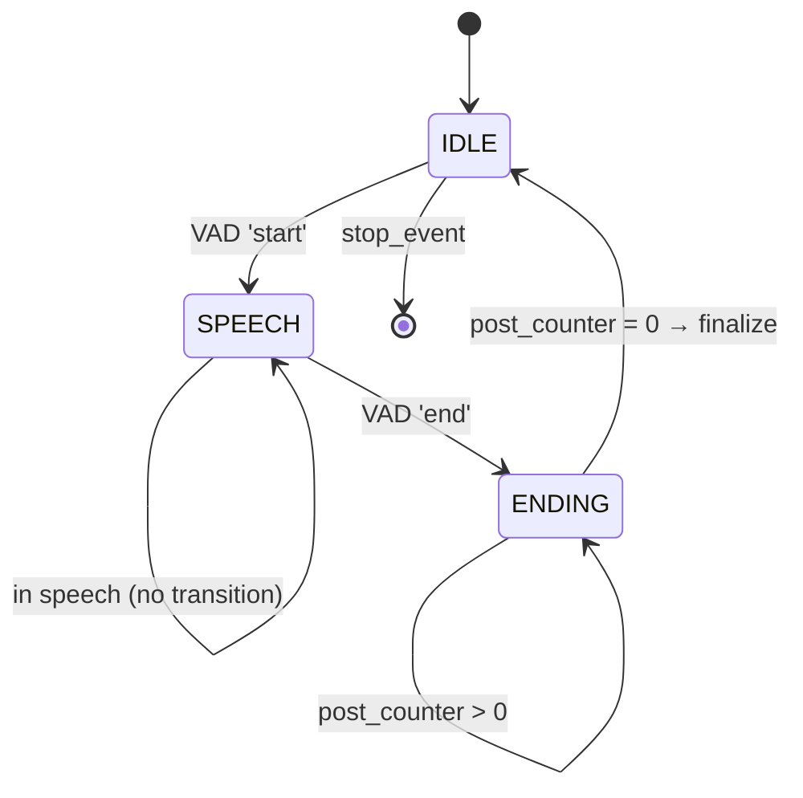

# Real-Time Audio Capture & VAD — Architecture

## 1. Tổng quan

**Mục tiêu:** Capture loopback audio từ Windows WASAPI, phát hiện speech/silence real-time bằng Silero VAD, chunk thành các utterance riêng rẽ sẵn sàng cho Phase 2 (ASR + translation).

**Kiến trúc:** 3-tier Producer-Consumer pipeline với bounded blocking queues.

```
[Capture Thread]  → raw_queue →  [DSP+VAD Thread]  → segment_queue →  [Consumer Thread]
  (callback mode)   Queue        (soxr + Silero)     Queue           (log + WAV + callback)
```

**Công nghệ:**
- Audio capture: `PyAudioWPatch` (WASAPI loopback, **callback mode**)
- VAD: `silero-vad` 6.2.1 (`VADIterator` streaming API, PyTorch CPU)
- Resample: `soxr.ResampleStream` (SIMD-optimized, stateful, không tensor roundtrip)
- File I/O: `soundfile` (trên thread riêng, không block capture)
- UI: `tkinter` + `pynput` (global hotkeys)

---

## 2. Data Flow

### 2.1. Pipeline tổng thể

```
[WASAPI Loopback Device]
  │  PCM int16, device_rate Hz (vd 48kHz), N channels
  ▼
┌─────────────────────────────┐
│ CaptureThread._callback()   │ ← PortAudio audio thread
│   - raw_buffer.put_nowait() │
│   - đọc status_flags        │
│   - đếm paInputOverflow     │
└──────────┬──────────────────┘
           │ raw_queue (queue.Queue, bounded maxsize=30)
           ▼
┌──────────────────────────────────────┐
│ Pipeline._dsp_loop()                 │ ← daemon thread
│   - raw_buffer.get(timeout=1.0)     │   blocking, zero-poll
│   - gọi DspVad.process_chunk()      │
│   - push segment → segment_queue    │
│   - đếm dropped_segments            │
└──────────┬───────────────────────────┘
           │ segment_queue (queue.Queue, bounded maxsize=10)
           ▼
┌──────────────────────────────────────┐
│ Pipeline._consumer_loop()            │ ← daemon thread
│   - nhận segment                     │
│   - emit event → UI log_queue        │
│   - push WAV → wav_queue             │
│   - gọi segment_callback (Phase 2)   │
└──────────────────────────────────────┘

┌──────────────────────────────────────┐
│ Pipeline._wav_loop()                 │ ← daemon thread (nếu DEBUG_SAVE_WAV)
│   - wav_queue.get(timeout=0.1)      │
│   - sf.write() → .wav file           │
└──────────────────────────────────────┘
```

### 2.2. Chi tiết DSP+VAD (một chunk)

```
raw_bytes (bytes)
  │
  ▼
np.frombuffer(raw, int16)
  │  shape: (N * channels,)
  ▼
reshape(-1, channels)
  │
  ├─ Nếu stereo:
  │   average_safe: (L.int32 + R.int32) // 2 → int16
  │   hoặc lấy left channel
  │
  └─ Nếu mono: raw
      │
      ▼
astype(float32) / 32768.0
  │  float32 mono [-1.0, 1.0]
  ▼
soxr.ResampleStream.resample_chunk()
  │  SIMD, stateful (giữ internal history)
  │  device_rate → 16kHz
  │  output ~512 samples (với fixed 1536 input)
  ▼
Pre-allocated accumulator (accum_buf, float32[2048])
  │  slice assign + shift (không np.concatenate)
  │  đợi đến khi ≥ 512 samples
  ▼
Cắt đúng 512 samples → update_pre_buffer
  │
  ▼
silero_vad.VADIterator(chunk_16k, return_seconds=True)
  │  LSTM-based neural inference
  │  output: None / {"start": t} / {"end": t}
  ▼
State Machine: IDLE → SPEECH → ENDING
  │
  ├─ IDLE:   duy trì pre_buffer (ring, pre_pad_samples)
  ├─ SPEECH: append vào segment_buf pre-allocated
  └─ ENDING: append post-pad, finalize
              │
              ▼
            (segment, speech_ms, total_ms) → segment_queue
```

---

## 3. Threading Model

### 3.1. Current (Phase 1 — finalized)

```
Main Thread (hoặc tkinter mainloop)
  │
  ├── Pipeline.start_async()
  │     ├── CaptureThread.start()
  │     │     └── PortAudio callback → raw_queue (audio thread)
  │     │
  │     ├── DSP+VAD daemon thread
  │     │     └── raw_queue.get() → process → segment_queue
  │     │
  │     ├── WAV writer daemon thread (nếu DEBUG_SAVE_WAV)
  │     │     └── wav_queue.get() → sf.write()
  │     │
  │     └── Consumer daemon thread
  │           └── segment_queue.get() → log + callback
  │
  ├── [UI: tkinter .after() polling log_queue]
  │
  └── Pipeline.stop()
        └── set stop_event → queues sentinel → join threads (timeout 3s)
```

### 3.2. Queue contracts

| Queue | Type | Maxsize | Producer | Consumer | Policy |
|---|---|---|---|---|---|
| `raw_buffer` | `queue.Queue[bytes]` | 30 | Callback (`put_nowait`) | DSP loop (`get`) | Drop oldest nếu full → `stats_dropped_raw++` |
| `segment_queue` | `queue.Queue[tuple]` | 10 | DSP loop (`put_nowait`) | Consumer loop (`get`) | Drop oldest nếu full → `stats_dropped_segments++` |
| `wav_queue` | `queue.Queue[tuple]` | 20 | Consumer loop (`put_nowait`) | WAV thread (`get`) | Sentinels None để shutdown |
| `log_queue` | `queue.Queue[PipelineEvent]` | Unbounded | Pipeline methods | UI tkinter poll | Không giới hạn (UI chậm thì drop) |

### 3.3. Real-time guarantees

| Cơ chế | Mục đích |
|---|---|
| Callback `put_nowait` (non-blocking) | Không bao giờ block PortAudio audio thread |
| `deque→queue.Queue` + `get(timeout=1.0)` | DSP thread không polling, không timer jitter |
| `stop_event` + sentinel `None` | Shutdown an toàn, thread join timeout 3s |
| `paInputOverflow` counter | Phát hiện driver drop audio thật |
| `dropped_raw_chunks` counter | Phát hiện raw queue bị đầy (DSP chậm) |
| `dropped_segments` counter | Phát hiện consumer queue bị đầy (ASR chậm) |

---

## 4. Core Modules

### 4.1. `core/capture_thread.py` — CaptureThread

**Vai trò:** Sở hữu `PyAudio` instance và PortAudio stream callback. Là tầng duy nhất tiếp xúc với hardware audio.

**Callback mode:** PortAudio gọi `_callback()` từ audio thread riêng. Callback chỉ làm 3 việc:
```python
# 1. Đọc status_flags → detect overflow
if status_flags & pyaudio.paInputOverflow:
    self.stats_overflow += 1

# 2. Push raw bytes → raw_queue (non-blocking)
try:
    self.raw_buffer.put_nowait(in_data)
except queue.Full:
    self.stats_dropped_raw += 1

# 3. Báo PortAudio tiếp tục
return (None, pyaudio.paContinue)
```

**Key design decisions:**
- `queue.Queue.put_nowait()` dùng C-level mutex — không lock-free như `deque.append()` (GIL-atomic), nhưng uncontended path ~100ns, chấp nhận được.
- `frames_per_buffer` tính từ `CHUNK_SIZE * device_rate / TARGET_SAMPLE_RATE` (vd 512×48000/16000 = 1536 samples), produce ~512 samples @ 16kHz sau resample.
- Có thể thử `paFramesPerBufferUnspecified` trong tương lai (đã có accumulator ở tầng DSP để handle mọi buffer size).

### 4.2. `core/dsp_vad.py` — DspVad

**Vai trờ:** Resample (soxr), stereo→mono (average_safe), VAD inference, state machine, segment accumulation.

**Optimizations applied (so với phiên bản monolithic đầu tiên):**
1. `torchaudio Resample` → `soxr.ResampleStream` (SIMD, stateful, numpy→numpy, không tensor)
2. `np.mean(axis=1)` → `average_safe` (int32 arithmetic, không overflow, không phase cancellation)
3. `np.concatenate` mỗi chunk → pre-allocated `accum_buf[2048]` với write pointer
4. `list[ndarray]` + `np.concatenate` → pre-allocated `segment_buf[MAX_SEGMENT_SAMPLES]` + slice assign
5. `speech_buffer` list → `write_pos` + `speech_only_start` integer tracking
6. `reset_states()` sau mỗi segment → chỉ reset sau silence > `VAD_RESET_SILENCE_THRESHOLD_MS` (500ms)

**Accumulator ring buffer:**
```
Trước resample: accum_buf[float32] size 2048 (CHUNK_SIZE × 4)
  - write: accum_buf[accum_pos:accum_pos + n_out] = resampled
  - khi accum_pos ≥ 512: cắt chunk_16k = accum_buf[:512].copy()
    shift phần dư: accum_buf[:remaining] = accum_buf[512:accum_pos]
  - đảm bảo VAD luôn nhận đúng 512 samples bất kể buffer size đầu vào
```

**State machine:**


### 4.3. `core/pipeline.py` — Pipeline

**Vai trò:** Khởi tạo, phối hợp 3 thread, expose API đồng bộ (`run`) và bất đồng bộ (`start_async`/`stop`).

**API:**
- `run(stop_event)` — blocking (console mode), gọi `_consumer_loop` trên main thread
- `start_async()` — non-blocking (UI mode), consumer chạy trong daemon thread
- `stop()` — set event + sentinel + join threads
- `get_stats()` — dict: chunks, state, dropped_raw_chunks, dropped_segments, pa_input_overflows

**`_dsp_loop` — evolution:**
- **V1:** `deque.popleft()` + `time.sleep(0.002)` — polling, timer jitter ±15ms
- **Current:** `queue.Queue.get(timeout=1.0)` — blocking via `threading.Condition`, zero polling
- Timeout 1.0s dùng để detect device disconnection ("No audio received for 1s" log)

### 4.4. `core/config.py` — CaptureConfig

```python
@dataclass
class CaptureConfig:
    # Audio
    TARGET_SAMPLE_RATE: int = 16000
    CHUNK_SIZE: int = 512                  # VAD window size (samples @ 16kHz)

    # VAD
    VAD_THRESHOLD: float = 0.5
    PRE_SPEECH_PAD_MS: int = 300
    POST_SPEECH_PAD_MS: int = 200
    MIN_SPEECH_DURATION_MS: int = 300
    VAD_RESET_SILENCE_THRESHOLD_MS: int = 500

    # Queue bounds
    RAW_QUEUE_MAXSIZE: int = 30
    SEGMENT_QUEUE_MAXSIZE: int = 10
    WAV_QUEUE_MAXSIZE: int = 20

    # Debug
    DEBUG_SAVE_WAV: bool = True
    DEBUG_SAVE_DIR: str = "captured_speech"

    # Quality
    RESAMPLE_QUALITY: str = "HQ"           # soxr quality: "HQ" / "MQ" / "LQ"
    MONO_STRATEGY: str = "average_safe"    # "average_safe" / "left_channel"

    # Derived properties (computed on access)
    PRE_SPEECH_PAD_SAMPLES, POST_SPEECH_PAD_SAMPLES,
    MIN_SPEECH_DURATION_SAMPLES, MAX_SEGMENT_SAMPLES
```

### 4.5. `core/ui.py` — CaptureUI

**Vai trò:** Tkinter window + global hotkeys cho điều khiển pipeline.

**Components:**
- Status dot (green=recording, red=stopped, yellow=error)
- Start/Stop toggle button
- Device name label
- Level meter canvas (green SPEECH bar / yellow ENDING / gray SILENCE)
- Scrolling chunk log (Listbox, max 100 entries)
- Stats bar (chunks count, dropped count)
- Hotkey labels (Ctrl+Shift+R toggle, Ctrl+Shift+Q quit)

**Thread safety:**
- `pynput` hotkey listener chạy trong daemon thread → gọi `root.after(0, callback)` để marshal lên tkinter thread
- log queue polled mỗi 100ms via `root.after(100, poll)` — tkinter thread-safe
- level meter updated mỗi 150ms via `root.after(150, _update_meter)`

### 4.6. `core/audio_capture.py` — AudioCapture

Backward-compatible wrapper giữ nguyên interface của phiên bản đầu:
```python
class AudioCapture:
    def __init__(self, callback=None, config=None)
    def set_callback(self, callback)
    def start(self, stop_event)        # → pipeline.run(stop_event)
    def cleanup(self)
```

### 4.7. `core/benchmark.py` — Benchmark

Hai chế độ:
- **CPU benchmark** (`--real` không set): synthetic 48kHz stereo chunks, đo `dsp.process_chunk()` time
- **Overflow test** (`--real --duration 300`): capture từ device thật N giây, in 3 counter (paInputOverflow, dropped_raw_chunks, dropped_segments)

---

## 5. Memory Management

### 5.1. Buffers

| Buffer | Vị trí | Type | Size (fixed) | Purpose |
|---|---|---|---|---|
| `accum_buf` | DspVad | `ndarray(float32)` | 2048 samples × 4B = 8KB | Ring accumulator before VAD |
| `pre_buffer` | DspVad | `list[ndarray]` | up to ~4800 samples = ~19KB | Ring pre-speech pad |
| `segment_buf` | DspVad | `ndarray(float32)` | `MAX_SEGMENT_SAMPLES` × 4B = 1.92MB (30s) | Speech segment accumulation |
| `raw_buffer` | Pipeline | `queue.Queue` | maxsize=30 × ~3KB = ~90KB | Raw int16 bytes queue |
| `segment_queue` | Pipeline | `queue.Queue` | maxsize=10 × ~240KB = ~2.4MB | Segment tuple queue |

### 5.2. Copy overhead per chunk (current)

| Step | Operation | Allocations |
|---|---|---|
| `np.frombuffer` | Zero-copy view | 0 |
| `average_safe` | `astype(int32)` ×2 + `// 2` + `astype(int16)` | 3 temporary |
| `astype(float32)` | New array | 1 |
| `resample_chunk` | soxr output | 1 |
| `accum_buf[...] = resampled` | Slice assign | 0 |
| `chunk_16k = accum_buf[:512].copy()` | 1 copy | 1 |
| `accum_buf[:remaining] = accum_buf[512:pos]` | Shift copy | 0 |
| `pre_buffer.append(chunk_16k)` | No copy (same array ref) | 0 |
| `segment_buf[pos:pos+n] = chunk_16k` | Slice assign | 0 |
| `_finalize_segment: .copy()` | 1 copy (final output) | 1 |

So với bản đầu: từ **2 copies per chunk** (và thêm concat toàn bộ segment cuối) → **1 copy per chunk** + 1 copy segment cuối.

---

## 6. Performance

### 6.1. Synthetic benchmark (500 chunks, 48kHz stereo)

| Metric | Before (v1) | Current | Change |
|---|---|---|---|
| `dsp.process_chunk()` avg | 1.860 ms | 1.229 ms | −34% |
| `dsp.process_chunk()` median | — | 1.138 ms | — |
| `dsp.process_chunk()` p99 | — | 3.076 ms | — |

Headroom: 1.138ms processing mỗi 32ms audio → **~97% headroom**.

### 6.2. Real-device overflow test (120s, có audio)

| Counter | Value |
|---|---|
| `paInputOverflow` | 0 |
| `dropped_raw_chunks` | 0 |
| `dropped_segments` | 0 |

---

## 7. Configuration Parameters

| Parameter | Default | Range | Khi nào cần tune |
|---|---|---|---|
| `VAD_THRESHOLD` | 0.5 | 0.0–1.0 | Môi trường ồn ↑, speech rõ ↓ |
| `PRE_SPEECH_PAD_MS` | 300 | 0–1000 | Giảm nếu muốn latency thấp |
| `POST_SPEECH_PAD_MS` | 200 | 0–1000 | Giảm nếu VAD cắt đuôi chính xác |
| `MIN_SPEECH_DURATION_MS` | 300 | 100–2000 | Tăng nếu false positive noise |
| `RESAMPLE_QUALITY` | "HQ" | "HQ"/"MQ"/"LQ" | "MQ" nếu CPU yếu (giảm ~40% resample time) |
| `MONO_STRATEGY` | "average_safe" | "average_safe"/"left_channel" | "left_channel" nếu phase cancellation confirmed |
| `RAW_QUEUE_MAXSIZE` | 30 | 10–100 | Tăng nếu DSP latency cao bất thường |
| `LOG_INTERVAL_CHUNKS` | 5 | 1–100 | Console mode: tăng để giảm print overhead |

---

## 8. Phase 2 — Integration Points

### 8.1. `segment_callback`

```python
def segment_callback(segment: np.ndarray, speech_ms: float, total_ms: float):
    """segment: float32 mono @ 16kHz, in-memory, không cần WAV.
       speech_ms: thời gian speech thực (không pad).
       total_ms: tổng duration segment (bao gồm pad).
    """
```

Gán qua `Pipeline.set_segment_callback(callback)`.
Chạy trong consumer thread — nếu callback blocking, segment_queue sẽ đầy và drop oldest.

### 8.2. Queue sizing cho ASR

Nếu Phase 2 dùng Faster-Whisper (C++ core, thường release GIL) → khả năng không cần multiprocessing.
Nếu dùng whisper Python thuần → GIL contention có thể gây `dropped_raw_chunks > 0` → cần:

- Tăng `RAW_QUEUE_MAXSIZE` (buffer nhiều hơn)
- Hoặc tách ASR ra process riêng (multiprocessing, `shared_memory`)
- Hoặc giảm `RESAMPLE_QUALITY` xuống "MQ" để giảm CPU

### 8.3. Counter monitoring

Consumer loop có thể đọc `get_stats()` định kỳ và log cảnh báo nếu bất kỳ counter nào > 0, trigger adaptive quality fallback:
```python
if stats["pa_input_overflows"] > THRESHOLD:
    config.RESAMPLE_QUALITY = "MQ"  # adaptive fallback
```

---

## 9. Known Limitations

| Issue | Impact | Plan |
|---|---|---|
| `queue.Queue.put_nowait()` trong callback | Lock acquire ~100ns mỗi chunk | Có thể revert `deque` + `threading.Event` nếu overflow xuất hiện |
| Silero VAD reset chỉ sau 500ms silence | Có thể miss speech onset nếu người nói ngắt quãng ngắn | Tune threshold per use case |
| `pre_buffer` dùng `list.pop(0)` | O(n) per chunk (với n ≤ 10) → không đáng kể | Có thể ring buffer thuần numpy |
| soxr leak khi interpreter shutdown | Nanobind reference counting issue | Upstream fix hoặc `gc.collect()` trước exit |
| No crossfade at boundaries | Click artifact nếu VAD cắt giữa âm | Phase 2: linear fade-in/out 5ms |
| No WASAPI exclusive mode | Thêm ~10ms latency so với exclusive | Phase 3 nếu cần latency < 20ms |

---

## 10. Tech Stack

| Package | Version | Layer |
|---|---|---|
| `pyaudiowpatch` | ≥0.2.12 | Audio I/O (WASAPI loopback) |
| `silero-vad` | ≥6.0.0 | VAD inference |
| `torch` | ≥1.12.0 | ML backend (Silero runtime) |
| `soxr` | ≥0.5.0 | SIMD resampling (thay torchaudio) |
| `soundfile` | ≥0.12.0 | WAV file I/O |
| `numpy` | ≥1.24.0 | Array processing |
| `pynput` | ≥1.7.0 | Global keyboard hotkeys |

### Optional
| Package | Công dụng |
|---|---|
| `pywin32` | Set thread priority (THREAD_PRIORITY_ABOVE_NORMAL) — bỏ qua nếu thiếu |
